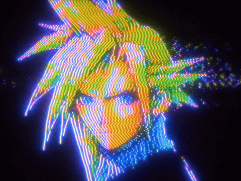

# Nix Flake Pirates (NFP)

> **☠️ Nix Flake Pirates (NFP) Configuration**



[](https://nixos.org)
[](https://docs.clan.lol)
[](https://github.com/hyprwm/Hyprland)
[](https://github.com/Mic92/sops-nix)

> **"Wealth, fame, power. Gold Roger, the King of the Pirates, attained this and everything else the world had to offer."**

Welcome to the **Nix Flake Pirates (NFP)** NixOS configuration repository. This system is a highly modular, declarative, and reproducible infrastructure based on **Clan-Core**, designed for high-performance creative workflows, AI development, and secure operations.

---

## 🏴‍☠️ The Grand Line Fleet

| Character | Machine | Role | Specs & Tags | State |
| :---: | :---: | :---: | :---: | :---: |
|  | **Z0r0** | Media & Build Server | **Laptop**: LG Gram 17z90q, **CPU**: i7-1260P, **RAM**: 16GB, **Tags**: Media-Server, AI-Server, Laptop | 🟢 Active |
|  | **Luffy** | Primary Workstation & AI | **Desktop**: Custom, **CPU**: i7-9700F, **RAM**: 24GB, **Tags**: Workstation, Desktop, AI-Server, Homelab | 🟢 Active |

---

## 🗺️ Fleet Services & Navigation

| Service | Machine | Port | Public URL | Role |
| :--- | :--- | :--- | :--- | :--- |
| **n8n** | Luffy | 5678 | `n8n.lovelain.duckdns.org` | Workflow Automation |
| **Open WebUI** | Luffy | 3004 | `chat.lovelain.duckdns.org` | AI Chat Interface |
| **Ollama** | Luffy | 11434 | `ollama.lovelain.duckdns.org` | AI Model Backend |
| **Nextcloud** | Luffy | 8080 | `nextcloud.lovelain.duckdns.org` | Cloud Storage & Files |
| **Immich** | Luffy | 2283 | `immich.lovelain.duckdns.org` | Photo Management |
| **Vaultwarden** | Luffy | 8222 | `vault.lovelain.duckdns.org` | Password Manager |
| **Komga** | Luffy | 25600 | `komga.lovelain.duckdns.org` | Comics/Manga Library |
| **Your Spotify** | Luffy | 3457 | `spotify.lovelain.duckdns.org` | Listening Analytics |
| **AdGuard Home** | Luffy | 3002 | `adguard.lovelain.duckdns.org` | DNS & Ad-Blocking |
| **Jellyfin** | Z0r0 | 8096 | `jellyfin.lovelain.duckdns.org` | Media Streaming |
| **Sonarr** | Z0r0 | 8989 | `sonarr.lovelain.duckdns.org` | TV Show Management |
| **Radarr** | Z0r0 | 7878 | `radarr.lovelain.duckdns.org` | Movie Management |
| **Prowlarr** | Z0r0 | 9696 | `prowlarr.lovelain.duckdns.org` | Indexer Manager |
| **SillyTavern** | Luffy | 8000 | `silly.lovelain.duckdns.org` | AI Roleplay Interface |

---

## ⚔️ The Arsenal (Features)

### 🖥️ Desktop Experience (Noctalia)

A heavily customized **Hyprland** environment driven by **Matugen** for dynamic material theming.

* **Neon Aesthetics**: Saber-like glowing borders and deep, rich shadows powered by Hyprland's `col.active_border` and `decoration.shadow`.
* **Matugen Integration**: Wallpaper-based color schemes that propagate to GTK, QT, Terminals, and Hyprland instantly.
* **Workflow Optimization**:
  * **Vicinae** & **Noctalia** launchers for instant access.
  * **Hyprspace** overview for workspace management.
  * **Yazelix**: A custom Helix-based modal editing environment.

### 🧠 Brain Force (AI Stack)

A robust local AI infrastructure fully provisioned by Nix:

* **Local LLMs**: Integrated **Ollama**, **LocalAI**, and **LM Studio**.
* **Vector Power**: **ChromaDB** and **Qdrant** for RAG applications.
* **Agents**: Pre-configured environments for **CrewAI**, **AutoGen**, and custom Python agents.
* **Automation**: **n8n** workflow automation server and **Home Assistant** integration.

### 🛡️ Ship Security & Privacy

* **Sops-Nix**: All secrets are encrypted at rest using Age encryption.
* **Impermanence**: Root filesystems are wiped on boot; only strictly defined state is persisted (Persistence as Code).
* **Headscale**: Secure mesh networking compatible with Tailscale.
* **AdGuard Home**: Network-wide ad blocking and DNS privacy.

---

## 🛠️ Technology Stack (Flakes)

Managed via `flake.nix` and `flake-parts`:

| Flake | Description | Usage |
| :--- | :--- | :--- |
| `clan-core` | Fleet Management | Modules, secrets, and deployment |
| `hyprland` | Window Manager | Tiling compositor and plugins |
| `home-manager` | User Environment | Dotfiles and user styling |
| `sops-nix` | Secrets Management | Encrypted secrets at rest |
| `impermanence` | State Management | Opt-in persistence for stateless root |
| `spicetify-nix` | Spotify Theming | Custom Spotify client theming |
| `nixos-hardware` | Hardware Quirks | Auto-configured hardware support |
| `llm-agents` | AI Tooling | Local AI agent environment |

---

## 🗺️ Architecture Structure

This configuration follows the **Clan-Core** architecture for scalable fleet management.

```mermaid
graph TD
    User[t0psh31f] -->|Manages| Flake[Flake.nix]
    Flake -- Imports --> Clan[Clan Inventory]

    subgraph Hosts
        Luffy[Luffy (Workstation)]
        Z0r0[Z0r0 (Media Server)]
    end

    subgraph Layers (Dendritic V2)
        Cyberia[00-Cyberia: Docs/Assets/Scripts]
        System[10-System: Foundation/Hardware]
        Services[20-Services: Infra/AI/Media]
        Theming[30-Theming: UI/Stylix]
        Desktop[40-Desktop: Hyprland/Wayland]
        CLI[50-CLI: Shell/Tools]
        GUI[60-GUI: Browsers/Activities]
        Agents[70-Agents: LLM Tooling]
        Lib[80-Lib: Nix SDK/Helpers]
        Profiles[90-Profiles: Tag Aggregation]
    end

    Clan --> Luffy
    Clan --> Z0r0

    Luffy --> Profiles
    Z0r0 --> Profiles
```

---

## 🚀 Setting Sail (Quick Start)

### Prerequisites

* Nix enabled system (Linux/MacOS) with Flakes enabled.
* `direnv` installed.

### 1. Recruit the Crew (Clone)

```bash
git clone https://github.com/T0PSH31F/NFP.git
cd NFP
direnv allow
```

### 2. Update the Ship (Deploy)

Updates are handled via a self-hosted GitHub Actions runner:
1. Push changes to `main`.
2. The `deploy.yml` workflow formats, checks, and deploys to all active machines.

To manually trigger a deployment locally:
```bash
clan machines update luffy
```

### 3. Unlock the Treasure (Secrets)

```bash
sops treasure/secrets/vicinae.yaml
```

---

## 📦 Allied Crews (Related Projects)

### [VegaNix Records](https://github.com/T0PSH31F/grandlix-devenvs)

*(Formerly Grandlix-Devenvs)*
A separate repository hosting reproducible development environments for Python, Node.js, Rust, and Go. Kept separate to minimize the closure size of the main system flake.

---

## 📸 Gallery


---

## 📜 Pirate Code (License)

This project is licensed under the MIT License - see the LICENSE file for details.

---

> "I'm going to be the King of the Pirates!" — Monkey D. Luffy
