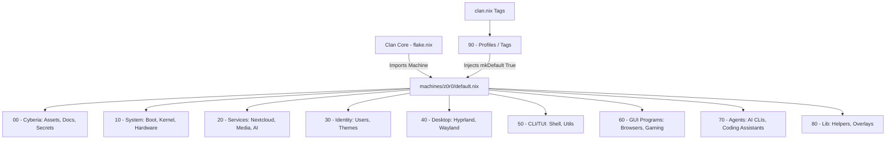

# NFP Profile Architecture & Tag System

This document outlines the tag-driven profile architecture used to effortlessly deploy machines within the NFP repository. By appending tags to a machine, it inherits pre-defined configurations from `layers/90-profiles/tags`, massively reducing boilerplate and redundancy.

## Layered Configuration Graph

The entire configuration flow is strictly layered from 00 to 90.

*Note: Features defined in `machines/<host>/default.nix` serve as absolute overrides. If a tag enables a feature you want off, set it to `false` in the machine config.*

## Available Machine Tags (Roles & Profiles)

Tags are explicitly matched via `clan.nix`. Ensure your tags in `clan.nix` perfectly match the ones defined inside your machine file's `machine.tags` list.

### 🖥️ Hardware & Form Factor

| Tag | Purpose | Enabled Configurations (`lib.mkDefault true`) |
| :--- | :--- | :--- |
| `workstation` | Standard usage and base limits | `resource-limits`, `nixTools`, `avahi`, `tailscale`, `monitoring`, `ssh-agent`, `grub-lain`, `plymouth-hellonavi` |
| `desktop` | Graphical UI & Bluetooth | `automount`, `bluetooth`, `flatpak`, `portals` |
| `laptop` | Portable power & network | `networkmanager`, `tlp` / `power-profiles-daemon` (Implicit) |
| `server` | Headless stability & networking | `monitoring`, `tailscale`, `adguard` |

### 🛠️ Dedicated Roles

| Tag | Purpose | Enabled Configurations (`lib.mkDefault true`) |
| :--- | :--- | :--- |
| `development` | Coding and software engineering | `pythonTools`, `vscode`, `dev-tools`, `antigravity`, `opencode` |
| `gaming` | Emulators and native PC gaming | `gui.gaming` |
| `ai-server` | Running LLMs and AI infrastructure | `homepage-dashboard`, `llm-agents`, `sillytavern`, `wyoming-services`, `ai-services.*`, `mcp`, `claude-code`, `ai-agent-stack` |
| `homelab` | Internal network hosting suite | `searxng`, `home-assistant-server`, `headscale-server`, `vaultwarden-server`, `filebrowser-app`, `glances-server` |
| `media-server` | Downloading and hosting media | `media-stack` (Jellyfin, Deluge, Radarr, Sonarr, Prowlarr) |
| `media` | Consuming media directly | `media-packages`, `audio`, `mpv` |
| `cache-server` | Nix binary cache | `harmonia.cache` |

## How to Customize / Tweak

1. **Tag-Level Defaults:** If you want ALL machines with the `homelab` tag to get a new service, edit `layers/90-profiles/tags/homelab.nix` and add it using `lib.mkDefault true`.
2. **Machine-Level Additions:** If ONLY `z0r0` needs a specific hardware flag (like Corsair drivers), add it directly to `features` in `machines/z0r0/default.nix` as `enable = true;`.
3. **Machine-Level Overrides:** If `luffy` has the `homelab` tag but you DO NOT want it to run `searxng`, add `services.searxng.enable = false;` explicitly in `machines/luffy/default.nix`. This overrides the `mkDefault true` injected by the tag.

## How to Deploy a New Machine

1. Copy `machines/template` to `machines/new-host`.
2. Generate its hardware profile: `nixos-generate-config --root /mnt --dir machines/new-host`.
3. Fill out the tags in `clan.nix` for the new machine.
4. Set overrides in `machines/new-host/default.nix`.
5. Run `clan machines update new-host`.
