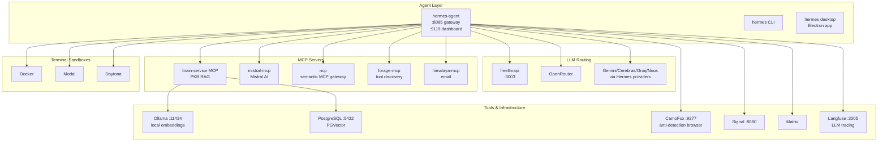

# AI Stack Architecture

> Complete reference for the NFP AI infrastructure — services, MCP servers, agent configuration, container deployment, and all after-install additions.

## Overview



## Service Map

| Port | Service | Purpose | Config File |
|------|---------|---------|-------------|
| **3003** | freellmapi | OpenAI-compatible LLM router (28 free providers, 339 models) | `layers/20-services/22-ai/freellmapi.nix` |
| **5432** | PostgreSQL (PGVector) | Vector store for brain-service PKB | — |
| **8010** | brain-service | PKB RAG API — PDF/EPUB/HTML/MD ingestion + query | `layers/20-services/22-ai/brain-service.nix` |
| **8080** | Signal REST API | Signal messaging bridge | — |
| **8085** | hermes MCP gateway | Tool orchestration protocol | `layers/70-agents/76-hermes-agent/hermes.nix` |
| **9119** | hermes dashboard | Admin panel (cyberpunk theme, no auth) | `layers/70-agents/76-hermes-agent/hermes.nix` |
| **9377** | CamoFox browser | Anti-detection Firefox (jo-inc fork), VNC at `:6080` | `layers/20-services/24-communication/camofox-browser.nix` |
| **11434** | Ollama | Local embeddings (`nomic-embed-text`) | — |
| **3005** | Langfuse | LLM observability & tracing | — |

## Agent Layer

### hermes-agent (systemd service)

The primary AI agent. Runs as a systemd service under the `hermes` user with state at `/var/lib/hermes/`.

**Key binaries:**
```
/run/current-system/sw/bin/hermes         # CLI wrapper
/run/current-system/sw/bin/hermes-agent    # Daemon
/run/current-system/sw/bin/hermes-desktop  # Electron desktop app (optional)
/run/current-system/sw/bin/hermes-acp      # ACP protocol
```

**Config:** `layers/70-agents/76-hermes-agent/hermes.nix`
**Secrets:** `layers/00-cyberia/03-treasure/secrets/external_services.yaml` (sops-encrypted)
**State dir:** `/var/lib/hermes/`

**Environment:** All API keys injected via sops template at `/run/secrets/hermes-env`.

### MCP Servers (registered with Hermes)

| Server | Command | Purpose |
|--------|---------|---------|
| **brain-service** | `brain-mcp` (system binary) | Query/ingest personal knowledge base. Tools: `brain_query`, `brain_remember`, `brain_ingest_book`, `brain_ingest_directory`, `brain_list_books` |
| **mistral** | `npx -y mistral-mcp@latest` | Full Mistral AI surface (HTTP mode, managed by systemd) |
| **ncp** | `npx -y @portel/ncp` | Semantic MCP gateway — reduces tool context overhead |
| **forage** | `npx -y forage-mcp` | Self-improving tool discovery & installation |
| **himalaya** | `node /home/t0psh31f/Projects/himalaya-mcp/dist/index.js` | Email integration via himalaya CLI |
| **freellmapi** | `bash -c '...'` (placeholder) | URL: `http://127.0.0.1:3003/mcp` once Hermes supports HTTP MCP transport |

### Terminal Sandbox Config

Containers spawned by Hermes for tool execution:

```nix
docker_image = "nikolaik/python-nodejs:python3.11-nodejs20";
container_cpu = 1;
container_memory = 5120;     # 5GB
container_disk = 51200;       # 50GB
container_persistent = true;
docker_run_as_host_user = true;
docker_forward_env = [
  "FREELMAPI_BASE_URL"        # Forwarded to terminal containers
];
docker_env = {
  FREELMAPI_BASE_URL = "http://host.docker.internal:3003/v1";
};
```

### Personalities (16 available)

Default is `jarvis`. Set via: `export HERMES_PERSONA=<name>`

| Persona | Style |
|---------|-------|
| `jarvis` (default) | Formal, dry British humor, "Sir" |
| `adjutant` | Clinical, monotone, tactical |
| `catgirl` | Anime, "nya~", kaomoji |
| `concise` | Brief, to the point |
| `cortana` | Witty, tactical, loyal |
| `creative` | Outside-the-box |
| `glados` | Sarcastic, passive-aggressive |
| `hal` | Soft-spoken, polite, no contractions, "Dave" |
| `helpful` | Friendly |
| `hype` | OVER-THE-TOP ENTHUSIASM |
| `kawaii` | (◕‿◕) sparkles |
| `noir` | Film noir detective |
| `philosopher` | Contemplates deeper meaning |
| `pirate` | "Arrr, ye be talkin' to Captain Hermes" |
| `samantha` | Warm, empathetic (Her) |
| `shakespeare` | Bardic prose |
| `surfer` | "Duuude, totally rad" |
| `teacher` | Patient, explanatory |
| `technical` | Detailed, precise |
| `uwu` | *nuzzles your code* OwO |

---

## freellmapi — Free-Tier LLM Router

OpenAI-compatible endpoint aggregating 28 free LLM providers (339 models).

**Endpoint:** `http://127.0.0.1:3003/v1`
**Web UI:** (first-run setup via browser at `http://127.0.0.1:3003`)

### Configuration

- **Service:** `layers/20-services/22-ai/freellmapi.nix`
- **Runtime:** Node.js 24 (switched from nodejs_22 to fix better-sqlite3 V8 ABI mismatch)
- **Database:** SQLite at `/var/lib/freellmapi/freeapi.db`
- **Encryption key:** Set via `ENCRYPTION_KEY` env var (auto-generated, stored in nix config)

### Usage

```bash
# List models
curl http://127.0.0.1:3003/v1/models

# Chat completion (with API key)
curl http://127.0.0.1:3003/v1/chat/completions \
  -H "Authorization: Bearer <api-key>" \
  -H "Content-Type: application/json" \
  -d '{"model":"gpt-3.5-turbo","messages":[{"role":"user","content":"Hello"}]}'
```

### Fallback Provider Config

In Hermes config, freellmapi is the **primary fallback provider**:

```nix
fallback_providers = [ "freellmapi" "openrouter" "nous" ];
```

### Container Access

Terminal containers spawned by Hermes can reach freellmapi via:
```
FREELMAPI_BASE_URL=http://host.docker.internal:3003/v1
```

### First-Run Setup

1. Visit `http://127.0.0.1:3003` in a browser
2. Use the setup code shown in the journal: `journalctl -u freellmapi | grep "setup code"`
3. Create the first admin account
4. Generate API keys for programmatic access

---

## Brain-Service — Personal Knowledge Base (PKB)

RAG system for querying ingested books, PDFs, EPUBs, articles, and websites.

**API:** `http://127.0.0.1:8010`
**MCP binary:** `/run/current-system/sw/bin/brain-mcp`
**Source dir:** `/home/t0psh31f/Notes/PKB/`
**Vector store:** PostgreSQL + PGVector (embeddings via Ollama's `nomic-embed-text`)
**Manifest:** `/var/lib/brain-service/manifest.json`

### Ingestion Stats

- **208 files ingested** (105 epub + 103 pdf)
- **18,927 document chunks** in the vector store
- Source dir has 347 files — remaining books can be ingested via API

### API Endpoints

| Method | Path | Description |
|--------|------|-------------|
| `GET` | `/health` | Health check |
| `GET` | `/manifest` | List all ingested files with chunk counts |
| `POST` | `/ingest/path?path=<file>` | Ingest a single file |
| `POST` | `/ingest/directory?directory=<dir>` | Ingest all files in a directory |
| `POST` | `/query` | Query the knowledge base |
| `POST` | `/remember` | Store a memory/text |
| `POST` | `/auto-remember` | Auto-scan and remember |
| `GET` | `/frequent-queries` | Show frequent query patterns |

### MCP Tools (via Hermes)

| Tool | Description |
|------|-------------|
| `brain_query` | Query ingested books with natural language |
| `brain_remember` | Store a fact/memory for later recall |
| `brain_ingest_book` | Ingest a single book by file path |
| `brain_ingest_directory` | Ingest all books in a directory |
| `brain_list_books` | List all ingested files |

### How to Ingest More Books

```bash
# Trigger directory ingestion via API
curl -X POST "http://127.0.0.1:8010/ingest/directory?directory=/home/t0psh31f/Notes/PKB/books"

# Or via MCP (if Hermes has brain tools registered)
brain_ingest_directory(directory="/home/t0psh31f/Notes/PKB/books")
```

---

## CamoFox Browser

Anti-detection Firefox browser based on the [jo-inc](https://github.com/jo-inc/camofox-browser) fork. Used by Hermes for web automation tasks.

**API:** `http://127.0.0.1:9377`
**OpenAPI docs:** `http://127.0.0.1:9377/docs`
**VNC:** `127.0.0.1:6080` (visual debugging)
**Service:** `layers/20-services/24-communication/camofox-browser.nix`

### Features

- **Per-userId session isolation:** each `userId` gets its own `BrowserContext` with persistent cookies at `/var/lib/camofox/profiles/<sha256(userId)>/`
- **Persistence plugin:** sessions survive browser restarts
- **API key:** Set via `CAMOFOX_API_KEY` env var

### Hermes Config

```nix
browser = {
  engine = "camofox";
  camofox = {
    managed_persistence = true;
    user_id = "hermes";
    session_key = "default";
    adopt_existing_tab = false;
    rewrite_loopback_urls = false;
    loopback_host_alias = "host.docker.internal";
  };
};
```

---

## mistral-mcp — Mistral AI MCP Server

Full Mistral AI surface exposed as an MCP server via Streamable HTTP.

**Service:** `layers/20-services/22-ai/mistral-mcp.nix`
**Command:** `npx -y mistral-mcp@latest`
**Mode:** HTTP server (systemd-managed)

### Configuration Fixes Applied

| Issue | Fix |
|-------|-----|
| `ENOENT: /.npm` (npm cache dir) | Added `HOME = "/tmp"` to service environment |
| `npx: sh not found` | Added `pkgs.bash` to service PATH |
| `env: node not found` | Added `pkgs.nodejs_22` to service PATH |

---

## After-Install Additions & Fixes

This section tracks all modifications made to the initial flake setup.

### Service Fixes

| Date | Service | Issue | Fix |
|------|---------|-------|-----|
| 2026-07-20 | freellmapi | Missing `dotenv` — workspace hoisting didn't copy root node_modules | `installPhase`: copy root `node_modules` + remove dangling symlinks |
| 2026-07-20 | freellmapi | `better-sqlite3` V8 symbol `ConvertToJSGlobalProxyIfNecessary` not exported by Node.js 22 | Switched build+runtime to `nodejs_24` (was `nodejs_22`) |
| 2026-07-20 | freellmapi | `ENCRYPTION_KEY` required in production mode | Generated 64-char hex key and added to service environment |
| 2026-07-20 | freellmapi | Port 3001 held by stale `conmon` (podman container) | Freed port with `fuser -k 3001/tcp` |
| 2026-07-20 | hermes-agent | `--replace` flag invalid at `gateway` level (needs `gateway run --replace`) | Changed `extraArgs` from `["--replace"]` to `["run", "--replace"]` |
| 2026-07-20 | hermes-agent | Existing user-level `hermes-gateway.service` blocked system-level startup | Stopped and disabled user-level service with `systemctl --user disable hermes-gateway.service` |
| 2026-07-20 | hermes CLI | Stale `~/.local/bin/hermes` wrapper pointed to non-existent venv | Removed stale wrapper; system path now uses `/run/current-system/sw/bin/hermes` |
| 2026-07-20 | mistral-mcp | `HOME` not set; `npx -y` couldn't write to `/.npm` cache | Added `HOME = "/tmp"` to service environment |
| 2026-07-20 | mistral-mcp | `npx` downloads require `node` for package scripts; `sh` for npm lifecycle | Added `pkgs.bash` and `pkgs.nodejs_22` to service PATH |
| 2026-07-20 | option namespace | `freellmapi` and `mistral-mcp` options under wrong namespace | Changed from `services.freellmapi` / `services.mistral-mcp` to `services.ai-services.*` |
| 2026-07-20 | deployment | `clan machines update z0r0` tries SSH to `192.168.1.39` (own IP), fails | Changed `deploy.targetHost` from `root@192.168.1.39` to `root@127.0.0.1` |

### Config Changes

| Change | File | Purpose |
|--------|------|---------|
| Added `FREELMAPI_BASE_URL` to container env | `hermes.nix` | Terminal containers can reach freellmapi via `host.docker.internal` |
| Generated SSH key for root | `/root/.ssh/` | Enables `clan machines update` SSH to localhost |
| Changed z0r0 deploy target | `clan.nix` | Local deployment via 127.0.0.1 instead of 192.168.1.39 |

---

## Container Deployment

### Horizontal Hermes Agent Deployment

The Hermes config is designed for reproducible, container-friendly deployment.

**Prerequisites for a new agent instance:**
1. Same Nix flake + hermes-agent input
2. Access to shared services (freellmapi, brain-service, PostgreSQL) via network
3. Unique `stateDir` per agent instance
4. Environment variables (API keys) injected via sops

**Key config for containerization:**

```nix
services.hermes-agent = {
  enable = true;
  settings = {
    terminal = {
      docker_image = "nikolaik/python-nodejs:python3.11-nodejs20";
      container_persistent = true;
      docker_run_as_host_user = true;
      docker_env.FREELMAPI_BASE_URL = "http://host.docker.internal:3003/v1";
    };
    # Fallback providers shared across all instances
    fallback_providers = [ "freellmapi" "openrouter" "nous" ];
  };
};
```

**For truly asynchronous team deployment:**
1. Deploy each Hermes instance as a separate systemd service with unique `stateDir`
2. Point all instances to the same shared Postgres (brain-service) and freellmapi
3. Each instance gets its own CamoFox user profile for browser session isolation
4. MCP servers (brain-service, mistral-mcp) can be shared or per-instance

## Quick Reference

```bash
# Service management
systemctl status freellmapi        # LLM router
systemctl status hermes-agent      # AI agent gateway
systemctl status mistral-mcp       # Mistral AI MCP
systemctl status brain-service     # PKB RAG
systemctl status podman-local-ai   # LocalAI container

# Check logs
journalctl -u freellmapi -n 20
journalctl -u hermes-agent -n 20
journalctl -u mistral-mcp -n 20
journalctl -u brain-service -n 20

# Deploy changes
clan machines update z0r0         # Apply flake changes

# Hermes CLI
hermes --version                   # Should show v0.18.0
hermes chat                        # Interactive chat
hermes desktop                     # Launch Electron desktop app

# Brain PKB
curl http://127.0.0.1:8010/health  # Check brain-service health
curl http://127.0.0.1:8010/manifest # List ingested books

# freellmapi API
curl http://127.0.0.1:3003/v1/models  # List available models
```

## Configuration Files

| File | Purpose |
|------|---------|
| `layers/70-agents/76-hermes-agent/hermes.nix` | Full Hermes config including MCP servers, personalities, terminal, browser |
| `layers/20-services/22-ai/freellmapi.nix` | freellmapi Nix build + systemd service |
| `layers/20-services/22-ai/mistral-mcp.nix` | Mistral MCP systemd service |
| `layers/20-services/22-ai/brain-service.nix` | Brain-service PKB systemd service |
| `layers/20-services/24-communication/camofox-browser.nix` | CamoFox browser service |
| `clan.nix` | Machine inventory, deploy targets, inventory services |
| `machines/z0r0/default.nix` | Machine-specific overrides, ai-services enable |
