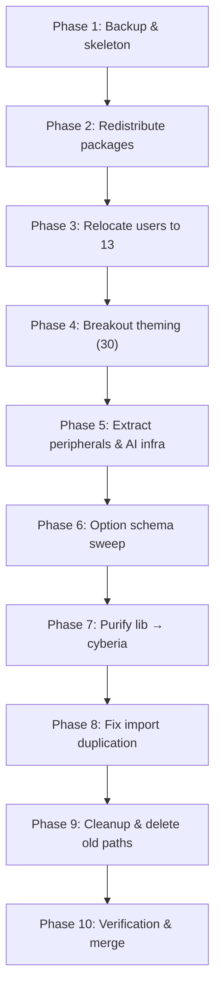

# NFP Dendritic Architecture Refinement (V2)

> Structural refactoring of the NFP repository to improve layer boundaries,
> eliminate the monolithic package dumping ground, modularize theming, and
> streamline machine onboarding. Zero behavior changes in structural phases.

---

## 1. Design Principles

1. **Cohesion over convenience.** Every file lives in the layer whose *purpose* it serves. Packages belong with their consumers, not in a shared dumping ground.
2. **Phased option migration.** Structural moves preserve existing option paths. A dedicated sweep phase updates `options.*` schemas *after* all files are in place.
3. **Compositor variables stay put.** Only theming-related options move to Tier 30. Display-pipeline env vars (`QT_WAYLAND_DISABLE_WINDOWDECORATION`, `NIXOS_OZONE_WL`, etc.) remain in their compositor layers.
4. **Copy → Switch → Delete.** Never broken paths. Commit after every phase.

---

## 2. Current State Snapshot

```
layers/
├── 00-cyberia/           # Scaffolding: docs, assets, secrets, clan config
│   ├── 01-docs/
│   ├── 02-assets/
│   ├── 03-treasure/
│   └── 07-clan/
├── 10-system/            # Base OS & Hardware
│   ├── 11-foundation/    # Nix settings, networking, optimization, caches, fonts
│   ├── 12-hardware/      # CPU/GPU/peripherals/platform (monolithic)
│   │   ├── 12.1-cpu/
│   │   ├── 12.2-gpu/
│   │   ├── 12.3-peripherals/   ← needs extraction
│   │   └── 12.4-platform/
│   ├── 13-packages/      # ← DUMPING GROUND (base, desktop, dev, gaming, media, pentest, ai)
│   ├── 14-virtualization/
│   ├── 15-storage/       # impermanence + google-drive mount
│   ├── 16-mobile/
│   ├── 17-app-runtimes/  # AppImage, Flatpak
│   └── 18-ai-infra/      # System-level AI stack
├── 20-services/          # System daemons (well-structured)
│   ├── 21–27             # networking, AI, media, comms, data, monitoring, automation
│   └── 28-clan-services/ # Clan service modules
├── 30-identity/          # ← MISNAMED (users + themes crammed together)
│   ├── 31-users/         # t0psh31f.nix, vps.nix (defunct)
│   └── 32-themes/        # greeter, grub, plymouth
├── 40-desktop/           # Compositors & DE (well-structured)
├── 50-cli-tui-programs/  # Terminal environment (well-structured)
├── 60-gui-programs/      # GUI applications (well-structured)
├── 70-agents/            # AI coding/voice/tooling agents
├── 80-lib/               # Nix library
│   ├── 81-helpers/       # mkDendriticModule, hm-bridge
│   ├── 82-overlays/      # Custom nixpkgs overlays
│   ├── 83-packages/      # Custom derivations
│   ├── 84-templates/     ← non-Nix-library (disko, machine, vm templates)
│   ├── 85-tests/         ← non-Nix-library (eval tests)
│   ├── 86-scripts/       ← non-Nix-library (shell scripts)
│   └── 87-iso/           ← non-Nix-library (ISO build)
└── 90-profiles/          # Tag-based composition
    └── tags/             # workstation, desktop, server, etc.
```

### Problems Identified

| Issue | Location | Impact |
|-------|----------|--------|
| **Package dumping ground** | `13-packages/` has 7 domain-specific files that belong with their consumers | Gaming packages imported even on servers; no isolation |
| **Layer 30 naming/scope mismatch** | `30-identity` = users + themes. Neither is "identity" | Confusing semantics; blocks expansion of theming |
| **Peripherals trapped inside hardware** | `12.3-peripherals/` buried 3 levels deep in `12-hardware/` | Can't toggle peripherals independently from CPU/GPU |
| **AI infra in system layer** | `18-ai-infra/` is system-level but functionally part of agent stack | Semantic confusion with GPU compute vs. agent runtimes |
| **Lib layer impure** | `84-templates/` through `87-iso/` are operational, not library code | Dilutes the purpose of `80-lib` as a pure Nix SDK |
| **Hardcoded username** | `mkDendriticModule` hardcodes `home-manager.users.t0psh31f` | Blocks multi-user or VPS deployments |
| **Defunct VPS config** | `vps.nix` references a decommissioned server | Dead code |
| **Import duplication** | Both `workstation.nix` tag AND `machines/*/default.nix` import the same layers | Duplicate evaluation, confusing ownership |
| **No machine template** | Adding a new machine requires manually wiring ~8 import paths + tag config | High friction for fleet expansion |

---

## 3. Target State

### Tier 00 — Cyberia (Scaffolding & Infrastructure)

| Layer | Contents |
|-------|----------|
| **01-docs** | Architecture docs, ADRs, migration notes |
| **02-assets** | Wallpapers, background videos, icons |
| **03-treasure** | SOPS secrets, age keys |
| **04-templates** | ← from `84-templates`: disko, machine, VM, container templates |
| **05-tests** | ← from `85-tests`: Nix evaluation tests |
| **06-scripts** | ← from `86-scripts`: deployment and helper shell scripts |
| **07-clan** | Clan inventory configuration |
| **08-iso** | ← from `87-iso`: ISO build configurations |

### Tier 10 — System (Base OS & Hardware Platform)

| Layer | Contents |
|-------|----------|
| **11-foundation** | Nix settings, networking, caches, fonts, clan-lib, overlays |
| **12-processor** | ← renamed from `12-hardware`. Strictly CPU/GPU architecture. Retains `12.1-cpu/`, `12.2-gpu/`, `12.4-platform/`. Peripherals removed. See §10 Hardware Audit for simplification guidance. |
| **13-users** | ← relocated from `31-users`. `t0psh31f.nix` (removes defunct `vps.nix`). User definitions are structural system foundation. |
| **14-virtualization** | Podman, libvirtd, containers |
| **15-filesystem** | ← renamed from `15-storage`. Impermanence, mount config, google-drive |
| **16-mobile** | Split into separate toggles: `android.nix` (ADB, scrcpy, Waydroid, Valent), `ios.nix` (usbmuxd, ifuse, libimobiledevice), `common.nix` (KDE Connect, shared firewall rules). Each independently toggleable. |
| **17-app-runtimes** | AppImage, Flatpak |
| **18-peripherals** | ← extracted from `12.3-peripherals` + gaming HID devices. Unified under a single `enable` toggle. Sub-modules: `bluetooth.nix`, `touchpad.nix`, `razer.nix`, `controllers.nix` (Xbox/xone/xpadneo, DualShock/dualsensectl, Steam controller udev), `rgb.nix` (OpenRGB, Corsair/ckb-next), `logitech.nix` (Solaar, udev rules), `automount.nix` (udisks2, devmon, gvfs). |
| **19-optimizations** | ← extracted from `11-foundation`. `optimization.nix` + `resource-limits.nix` unified |

### Tier 20 — Services (System Daemons)
No structural changes. Already well-organized.

### Tier 30 — Theming (Global Visual Stack)

| Layer | Contents |
|-------|----------|
| **31-cursor** | NEW. Hyprcursor theme settings, xcursor fallbacks, cursor size exports |
| **32-boot** | ← renamed from `32-themes`. Greeter (SDDM/greetd), GRUB themes, Plymouth themes |
| **33-gtk** | NEW. GTK theme engine, icon themes, dark mode, `adw-gtk3` settings |
| **34-qt** | NEW. QT6ct configuration, platform theme integration, qt style overrides |

### Tiers 40–60 — Desktop, CLI, GUI

Structurally unchanged except for receiving redistributed packages:

| Layer receives | File |
|----------------|------|
| `50-cli-tui-programs/` | `packages-dev.nix` ← already there ✓ |
| `60-gui-programs/` | `packages-desktop.nix` ← already there ✓ |
| `60-gui-programs/62-media/` | `packages-media.nix` ← from `13-packages/media.nix` |
| `60-gui-programs/65-gaming/` | `packages-gaming.nix` ← from `13-packages/gaming.nix` |
| `60-gui-programs/66-security/` | `packages-pentest.nix` ← from `13-packages/pentest.nix` |

### Tier 70 — Agents (AI Automation)

| Layer | Contents |
|-------|----------|
| **71-coding** | Claude-code, gemini-cli, antigravity, opencode, codex |
| **72-voice** | ASR/TTS agent audio |
| **73-tooling** | MCP, Fabric |
| **74-ai-infra** | ← from `18-ai-infra`. `ai-agent-stack.nix` lives with agent ecosystem |
| `packages-ai.nix` | ← already there ✓ (from `13-packages/ai.nix`) |

### Tier 80 — Lib (Pure Nix SDK)

Purified to contain ONLY:
- **81-helpers/** — `mkDendriticModule.nix`, `hm-bridge.nix`, `mkMachineFromTags.nix`
- **82-overlays/** — Custom nixpkgs overlays
- **83-packages/** — Custom package derivations

### Tier 90 — Profiles (Composition Layer)
Functionally unchanged but updated to reference new layer paths.

---

## 4. Major Architectural Suggestions

### A. Fix the Import Duplication Problem

**Current issue:** `workstation.nix` tag imports `../../10-system`, `../../20-services`, `../../30-identity`, `../../40-desktop`, `../../50-cli-tui-programs`, `../../60-gui-programs`, `../../70-agents`. But `machines/luffy/default.nix` ALSO imports `../../layers/10-system`, `../../layers/20-services`, `../../layers/30-identity/31-users/t0psh31f.nix`. The `workstation` tag already applies to luffy via `mkMachineFromTags`.

**Solution:** Machine configs should ONLY contain:
1. `./hardware.nix` and `./disko.nix` (machine-specific)
2. User import (if not already covered by a tag)
3. Feature flag overrides (`layers.layer-XX.*`)
4. Service-specific inline config (Caddy routes, postgres, ACME, etc.)

All tier imports should be delegated to tags exclusively. This eliminates the double-import issue and makes it crystal clear: *"tags bring the layers, machines bring the overrides."*

### B. Machine Onboarding Template (`00-cyberia/04-templates/machine/`)

Create a scaffolding template that makes adding a new machine to the fleet trivial:

```
04-templates/machine/
├── default.nix.template    # Skeleton with all section headers
├── hardware.nix.template   # nixos-facter or hardware-scan stub
└── README.md               # Step-by-step onboarding guide
```

**Onboarding workflow:**
1. `cp -r layers/00-cyberia/04-templates/machine machines/<name>`
2. Run `nixos-facter` or `nixos-generate-config` to populate `hardware.nix`
3. Add the machine entry to `clan.nix` with appropriate tags
4. Set machine-specific overrides in `default.nix`
5. `clan machines update <name>`

### C. Parameterize the Username in `mkDendriticModule`

**Current issue:** Line 40 of `mkDendriticModule.nix` hardcodes:
```nix
home-manager.users.t0psh31f = safeHomeConf;
```

**Suggestion:** Accept the username as a parameter or read it from a `config.layers.primaryUser` option. This makes the entire dendritic system reusable for VPS deployments, multi-user workstations, and future fleet members with different usernames.

```nix
# Conceptual: read from config
home-manager.users.${config.layers.primaryUser or "t0psh31f"} = safeHomeConf;
```

### D. Consolidate `13-packages/base.nix` into `11-foundation/`

`base.nix` contains truly foundational utilities (coreutils, git, curl, rsync, jq, etc.). These are not "packages" in the domain sense — they ARE the foundation. Moving `base.nix` into `11-foundation/` as `base-packages.nix` completes the elimination of the `13-packages/` layer entirely.

After redistribution, `13-packages/` becomes `13-users/` with zero leftover files.

### E. Remove Defunct `vps.nix` and Clean Up `flake.nix` VPS Reference

**Current state:** `layers/30-identity/31-users/vps.nix` (276 bytes) references a decommissioned VPS. The `flake.nix` still has a `flake.homeConfigurations."root@vps"` block (lines 184-208) that references the old VPS.

**Suggestion:** Remove `vps.nix` entirely. Comment out or remove the `flake.homeConfigurations."root@vps"` block with a `# TODO: Re-enable when new VPS is provisioned` marker. When the future VPS arrives, create a fresh user profile in `13-users/`.

### F. Service Layer Default-Off Pattern

**Observation:** Your service layer modules (`20-services/`) are imported globally but gated by `mkEnableOption`. This is correct. However, the tag profiles (`90-profiles/tags/homelab.nix`) directly set `services.searxng.enable = true` without going through the dendritic option system (`layers.layer-XX.*`).

**Suggestion:** Audit tag profiles and ensure they consistently use `layers.layer-20.services.config.*` toggles rather than raw `services.*` toggles. This ensures all service enablement flows through the dendritic option tree, making it auditable and override-friendly from machine configs.

### G. Create a `layers.meta` Option for Fleet-Wide Metadata

**Concept:** Add a lightweight option at the root of the layer system:

```nix
options.layers.meta = {
  primaryUser = lib.mkOption {
    type = lib.types.str;
    default = "t0psh31f";
    description = "Primary user for home-manager integration";
  };
  domain = lib.mkOption {
    type = lib.types.str;
    default = "lovelain.duckdns.org";
    description = "Primary DNS domain for service routing";
  };
  fleetNetwork = lib.mkOption {
    type = lib.types.str;
    default = "100.0.0.0/8";  # Tailscale/ZeroTier range
    description = "Internal fleet network CIDR";
  };
};
```

This eliminates hardcoded usernames across modules, centralizes DNS domain references (currently scattered across Caddy, ACME, DuckDNS configs), and creates a single source of truth for fleet-wide parameters.

---

## 5. Complete File Migration Map

### A. Package Redistribution (Purging Layer 13)

| Source | Target | Rationale |
|--------|--------|-----------|
| `10-system/13-packages/base.nix` | `10-system/11-foundation/base-packages.nix` | Foundational tools ARE foundation |
| `10-system/13-packages/desktop.nix` | Already at `60-gui-programs/packages-desktop.nix` | ✓ Already redistributed |
| `10-system/13-packages/dev.nix` | Already at `50-cli-tui-programs/packages-dev.nix` | ✓ Already redistributed |
| `10-system/13-packages/gaming.nix` | `60-gui-programs/65-gaming/packages-gaming.nix` | Gaming is GUI-tier |
| `10-system/13-packages/media.nix` | `60-gui-programs/62-media/packages-media.nix` | Media packages with media apps |
| `10-system/13-packages/pentest.nix` | `60-gui-programs/66-security/packages-pentest.nix` | Security tools with security layer |
| `10-system/13-packages/ai.nix` | Already at `70-agents/packages-ai.nix` | ✓ Already redistributed |

### B. User Config Relocation (31-users → 13-users)

| Source | Target | Notes |
|--------|--------|-------|
| `30-identity/31-users/t0psh31f.nix` | `10-system/13-users/t0psh31f.nix` | System-level user definition |
| `30-identity/31-users/vps.nix` | **DELETED** | Defunct VPS, no return |
| `30-identity/31-users/default.nix` | `10-system/13-users/default.nix` | Updated entry point |

### C. Theming Breakout (30-identity → 30-theming)

| Source | Target | Focus |
|--------|--------|-------|
| `30-identity/32-themes/greeter.nix` | `30-theming/32-boot/greeter.nix` | Login display manager |
| `30-identity/32-themes/grub-lain.nix` | `30-theming/32-boot/grub-lain.nix` | Bootloader theme |
| `30-identity/32-themes/plymouth-*.nix` | `30-theming/32-boot/plymouth-*.nix` | Boot animation |
| NEW | `30-theming/31-cursor/default.nix` | Hyprcursor theme, size, xcursor fallbacks |
| NEW | `30-theming/34-gtk/default.nix` | GTK theme engine, icons, dark mode |
| NEW | `30-theming/35-qt/default.nix` | QT6ct, platform themes, styles |

### D. Hardware & Infrastructure Extraction

| Source | Target | Rationale |
|--------|--------|-----------|
| `10-system/12-hardware/12.3-peripherals/*` | `10-system/18-peripherals/*` | Independent toggle from CPU/GPU |
| `10-system/18-ai-infra/*` | `70-agents/74-ai-infra/*` | Agent ecosystem cohesion |
| `10-system/11-foundation/optimization.nix` | `10-system/19-optimizations/optimization.nix` | Dedicated tuning layer |
| `10-system/11-foundation/resource-limits.nix` | `10-system/19-optimizations/resource-limits.nix` | Unified with optimization |

### E. Lib Layer Purification (80-lib → 00-cyberia)

| Source | Target | Rationale |
|--------|--------|-----------|
| `80-lib/84-templates/` | `00-cyberia/04-templates/` | Operational, not library |
| `80-lib/85-tests/` | `00-cyberia/05-tests/` | Operational, not library |
| `80-lib/86-scripts/` | `00-cyberia/06-scripts/` | Operational, not library |
| `80-lib/87-iso/` | `00-cyberia/08-iso/` | Operational, not library |

---

## 6. Option Schema Migration (Phase 6)

After all files are in place, update option prefixes in a single sweep:

| Old Prefix | New Prefix |
|------------|------------|
| `layers.layer-30.identity.users.*` | `layers.layer-10.system.users.*` |
| `layers.layer-30.identity.themes.*` | `layers.layer-30.theming.*` |
| `layers.layer-10.system.hardware.bluetooth.*` | `layers.layer-10.system.peripherals.bluetooth.*` |
| `layers.layer-10.system.hardware.corsair.*` | `layers.layer-10.system.peripherals.corsair.*` |
| `layers.layer-10.system.hardware.openrgb.*` | `layers.layer-10.system.peripherals.openrgb.*` |
| `layers.layer-10.system.hardware.automount.*` | `layers.layer-10.system.peripherals.automount.*` |

---

## 7. Execution Phases



### Phase 1: Safe Backup & Skeleton
1. `git branch backup-pre-refactor-v2-$(date +%Y%m%d)`
2. `git checkout -b refactor/dendritic-refinement-v2`
3. Create all new target directories (empty `default.nix` stubs where needed)
4. Commit: `refactor: phase 1 — skeleton directories`

### Phase 2: Redistribute Packages from Layer 13
1. Copy `gaming.nix` → `60-gui-programs/65-gaming/packages-gaming.nix`
2. Copy `media.nix` → `60-gui-programs/62-media/packages-media.nix`
3. Copy `pentest.nix` → `60-gui-programs/66-security/packages-pentest.nix`
4. Copy `base.nix` → `10-system/11-foundation/base-packages.nix`
5. Update `default.nix` imports in each target directory
6. Verify: `nix eval .#nixosConfigurations.luffy.config.system.build.toplevel.drvPath`
7. Commit: `refactor: phase 2 — package redistribution`

### Phase 3: Relocate Users to Layer 13
1. Create `10-system/13-users/`
2. Copy `t0psh31f.nix` with updated relative import paths
3. Remove defunct `vps.nix`
4. Update machine configs to import from new path
5. Verify both machines evaluate
6. Commit: `refactor: phase 3 — users to system layer`

### Phase 4: Refactor Theming (Layer 30)
1. Create `30-theming/` with `31-cursor/`, `32-boot/`, `34-gtk/`, `35-qt/`
2. Move boot themes from `32-themes/` to `32-boot/`
3. Extract cursor config into `31-cursor/default.nix`
4. Create GTK and QT theming modules
5. Wire new `default.nix` entry point
6. Verify evaluation
7. Commit: `refactor: phase 4 — theming breakout`

### Phase 5: Extract Peripherals & AI Infra
1. Rename `12-hardware/` → `12-processor/`
2. Move `12.3-peripherals/` → `18-peripherals/`
3. Move `18-ai-infra/` → `70-agents/74-ai-infra/`
4. Move `optimization.nix` + `resource-limits.nix` → `19-optimizations/`
5. Update `10-system/default.nix` and `12-processor/default.nix`
6. Verify evaluation
7. Commit: `refactor: phase 5 — peripheral & infra extraction`

### Phase 6: Option Schema Sweep
1. Find-and-replace option prefixes per Section 6 table
2. Update all tag profiles in `90-profiles/tags/`
3. Update all machine configs
4. Verify both machines evaluate
5. Commit: `refactor: phase 6 — option schema migration`

### Phase 7: Purify Lib Layer → Cyberia
1. Move `84-templates/` → `00-cyberia/04-templates/`
2. Move `85-tests/` → `00-cyberia/05-tests/`
3. Move `86-scripts/` → `00-cyberia/06-scripts/`
4. Move `87-iso/` → `00-cyberia/08-iso/`
5. Update `flake.nix` references (ISO build, checks, devShell)
6. Verify evaluation + `nix flake check`
7. Commit: `refactor: phase 7 — lib purification`

### Phase 8: Fix Import Duplication
1. Audit tag profiles vs machine configs for duplicate imports
2. Remove redundant tier imports from machine `default.nix` files
3. Ensure tags are the sole source of layer imports
4. Machine configs retain ONLY: `./hardware.nix`, user import, feature flags, service overrides
5. Verify evaluation
6. Commit: `refactor: phase 8 — import deduplication`

### Phase 9: Cleanup & Delete Old Paths
1. Confirm all modules successfully import from new locations
2. Delete emptied directories: `13-packages/`, `30-identity/`, `84-templates/`, `85-tests/`, `86-scripts/`, `87-iso/`
3. Remove `vps.nix` references from `flake.nix` (comment with TODO)
4. Clean up any `.gitkeep` files in now-populated directories
5. Verify: full `nix flake check` + both machine evaluations
6. Commit: `refactor: phase 9 — cleanup`

### Phase 10: Verification & Merge
1. Run full validation suite:
   ```bash
   nix flake check
   nix eval .#nixosConfigurations.z0r0.config.system.build.toplevel.drvPath
   nix eval .#nixosConfigurations.luffy.config.system.build.toplevel.drvPath
   ```
2. Present summary of all changes
3. WAIT for explicit approval
4. Merge: `git checkout main && git merge --no-ff refactor/dendritic-refinement-v2`

---

## 8. Post-Refactor Target Directory Structure

```
layers/
├── 00-cyberia/
│   ├── 01-docs/
│   ├── 02-assets/
│   ├── 03-treasure/
│   ├── 04-templates/          ← from 84
│   ├── 05-tests/              ← from 85
│   ├── 06-scripts/            ← from 86
│   ├── 07-clan/
│   └── 08-iso/                ← from 87
├── 10-system/
│   ├── 11-foundation/         # + base-packages.nix
│   ├── 12-processor/          # CPU + GPU only (renamed)
│   ├── 13-users/              # ← from 31-users (relocated)
│   ├── 14-virtualization/
│   ├── 15-filesystem/         # (renamed from storage)
│   ├── 16-mobile/
│   ├── 17-app-runtimes/
│   ├── 18-peripherals/        # ← from 12.3-peripherals (extracted)
│   └── 19-optimizations/      # ← from 11-foundation (extracted)
├── 20-services/               # (unchanged)
├── 30-theming/                # (renamed from identity)
│   ├── 31-cursor/             # NEW
│   ├── 32-boot/               # ← from 32-themes (renamed)
│   ├── 33-gtk/                # NEW
│   └── 34-qt/                 # NEW
├── 40-desktop/                # (unchanged)
├── 50-cli-tui-programs/       # (unchanged)
├── 60-gui-programs/           # + redistributed packages
│   ├── 62-media/              # + packages-media.nix
│   ├── 65-gaming/             # + packages-gaming.nix
│   └── 66-security/           # + packages-pentest.nix
├── 70-agents/
│   ├── 71-coding/
│   ├── 72-voice/
│   ├── 73-tooling/
│   ├── 74-ai-infra/           # ← from 18-ai-infra (relocated)
│   └── packages-ai.nix
├── 80-lib/                    # PURIFIED (Nix SDK only)
│   ├── 81-helpers/
│   ├── 82-overlays/
│   └── 83-packages/
└── 90-profiles/               # (unchanged, paths updated)
    └── tags/
```

---

## 9. Code Quality Standards

- **No** comments restating code. **Yes** to non-obvious decisions & workarounds.
- One-line file purpose header on every module.
- `nixfmt` or `alejandra`, 2-space indent, grouped attribute sets.
- Repeated patterns → `lib/`, repeated imports → profiles.

---

## 10. Hardware Module Redundancy Audit

> **Context:** NFP uses both `nixos-hardware` and `nixos-facter-modules` as flake inputs.
> `nixos-facter-modules` has been **archived** (read-only since April 2026), but `nixos-hardware`
> remains actively maintained and covers many of the same bases as your custom modules.

### Module-by-Module Verdict

| Your Module | What it does | Covered by nixos-hardware/facter? | Verdict |
|---|---|---|---|
| `intel.nix` | i915 early load, GuC, modesetting, `intel-media-driver`, `vaapiIntel`, `intel-compute-runtime` | **Partially.** `nixos-hardware` provides `common/cpu/intel` and `common/gpu/intel` which handle microcode, GuC, and media drivers. Your file adds `intel-compute-runtime` and `intel-ocl` (OpenCL) which `nixos-hardware` does not. | **SIMPLIFY**: Import `nixos-hardware.nixosModules.common-cpu-intel` and `common-gpu-intel` in machine `hardware.nix`. Keep a slim overlay for OpenCL extras. |
| `intel-7th-gen.nix` | i965 driver, TLP power, wifi firmware | **Mostly.** These are Nami-era quirks for a Dell XPS with Kaby Lake. | **DELETE**: Nami is decommissioned. If no active machine uses 7th gen, remove entirely. |
| `intel-12th-gen.nix` | Thermald disable, PPD, Thunderbolt bolt | **Yes.** `nixos-hardware` has `common/cpu/intel` + generation-specific modules. Thunderbolt is auto-detected. | **SIMPLIFY**: Move the thermald quirk to z0r0's `hardware.nix` as a machine-specific override. Delete the generic module. |
| `nvidia.nix` | Modesetting, proprietary driver, vaapi driver | **Partially.** `nixos-hardware` has `common/gpu/nvidia` but your config adds specific power management choices and the legacy 580 driver override. | **KEEP**: Your NVIDIA tuning is highly specific (legacy 580 for luffy, stable for others). These quirks are not in `nixos-hardware`. |
| `nvidia-hybrid.nix` | PRIME offload, bus IDs placeholder | **Partially.** `nixos-hardware` has `common/gpu/nvidia` with PRIME support but bus IDs are always machine-specific. | **KEEP BUT MOVE**: This should live in a machine's `hardware.nix`, not as a generic layer module. Bus IDs are per-machine by definition. |
| `amd.nix` | amdgpu initrd, AMDVLK, ROCm | **Partially.** `nixos-hardware` covers basic AMD GPU. ROCm/OpenCL is your addition. | **SIMPLIFY**: Import `nixos-hardware` AMD base. Keep ROCm as an overlay. |
| `common.nix` (12.4-platform) | Kernel selection, automount, OpenRGB, Corsair, Bluetooth, Logitech, fwupd, microcode, graphics, fstrim | **Mixed.** fwupd, microcode, firmware, graphics, fstrim are all covered by `nixos-hardware/common`. Kernel selection, OpenRGB, Corsair, automount are YOUR additions. | **SPLIT**: Move auto-detected stuff (fwupd, microcode, firmware, fstrim) to foundation or delete (let `nixos-hardware` handle). Keep kernel selection in `12-processor/`. Move peripheral items (OpenRGB, Corsair, Bluetooth, Logitech, automount) to `18-peripherals/`. |
| `audio.nix` | PipeWire stack, pavucontrol, audacity | **No.** Audio stack config is policy, not hardware detection. | **KEEP**: This is configuration preference, not detectable. Move to `12-processor/12.4-platform/audio.nix`. |
| `laptop.nix` | PPD, upower, libinput, brightnessctl, keyboard backlight | **Partially.** `nixos-hardware` laptop modules handle some power management. | **KEEP**: This is form-factor policy. Your keyboard backlight systemd unit is a custom quirk worth preserving. |
| `bluetooth.nix` | Bluetooth stack, blueman, auto-connect | **No.** Bluetooth is detected by facter/hardware but **configuration** (blueman GUI, auto-connect service) is policy. | **KEEP** in `18-peripherals/bluetooth.nix`. |
| `razer.nix` | OpenRazer daemon, polychromatic, razergenie | **No.** Peripheral-specific, no auto-detection. | **KEEP** in `18-peripherals/razer.nix`. |
| `touchpad.nix` | libinput, gestures, synaptics | **Partially.** Basic libinput is auto-detected but your gesture and synaptics config is policy. | **SIMPLIFY**: Remove the `services.xserver.synaptics` block (dead code, disabled). Keep libinput tuning in `18-peripherals/touchpad.nix`. |

### Recommendation Summary

1. **Add `nixos-hardware` imports to machine `hardware.nix` files** — `common/cpu/intel`, `common/gpu/nvidia`, etc. This gets you microcode, firmware, fwupd, fstrim, and basic driver detection for free.
2. **Delete `common.nix` auto-detected sections** — fwupd, microcode, `enableRedistributableFirmware`, `hardware.graphics`, fstrim are all handled upstream. Keep only your custom additions (kernel selection → `12-processor/`, peripherals → `18-peripherals/`).
3. **Delete `intel-7th-gen.nix`** — Nami is gone. Dead code.
4. **Move `nvidia-hybrid.nix`** bus ID config to machine-specific `hardware.nix` — it's per-machine by nature.
5. **Keep your NVIDIA, audio, and peripheral modules** — these contain policy decisions and quirks that no auto-detection tool covers.

---

## 11. Additional Architectural Suggestions

### H. Peripheral "Master Toggle" Pattern

Instead of individual enables scattered across `common.nix`, create a single entry point:

```nix
# 18-peripherals/default.nix
options.layers.layer-10.system.peripherals = {
  enable = mkEnableOption "All physical hardware peripherals";
  bluetooth.enable = mkEnableOption "Bluetooth stack";
  touchpad.enable = mkEnableOption "Touchpad/libinput tuning";
  razer.enable = mkEnableOption "Razer peripherals (OpenRazer)";
  controllers.enable = mkEnableOption "Game controllers (Xbox, DualShock, Steam)";
  rgb.enable = mkEnableOption "RGB lighting (OpenRGB, Corsair)";
  logitech.enable = mkEnableOption "Logitech peripherals (Solaar)";
  automount.enable = mkEnableOption "USB/disk auto-mounting";
};

# When peripherals.enable = true, all sub-toggles default to true
# Individual sub-toggles can still be overridden to false
```

This lets the `desktop` tag profile just say `peripherals.enable = true` and get everything, while a `server` profile can leave it off entirely.

### I. Mobile Module Split (16-mobile)

Break the existing `mobile-support.nix` into its own layer with independent toggles:

```
16-mobile/
├── default.nix      # Entry point: imports all, defines options
├── android.nix      # ADB, scrcpy, Waydroid, Valent, MTP
├── ios.nix          # usbmuxd, ifuse, libimobiledevice, ideviceinstaller
└── common.nix       # KDE Connect, firewall rules shared by both platforms
```

The existing code already has `cfg.android.enable` and `cfg.ios.enable` toggles — this refactor just promotes them to separate files for readability. The `common.nix` block (KDE Connect, `programs.kdeconnect.enable`) activates when either platform is enabled.

### J. Game Controller Sub-Module (`18-peripherals/controllers.nix`)

Extract controller-related config from `gaming.nix` (which currently sets `hardware.xone.enable`, `hardware.xpadneo.enable`, `services.input-remapper.enable`) into a dedicated peripheral module:

```nix
# 18-peripherals/controllers.nix
config = mkIf cfg.controllers.enable {
  hardware.xone.enable = true;       # Xbox One wireless dongle
  hardware.xpadneo.enable = true;    # Xbox controller Bluetooth
  services.input-remapper.enable = true;
  environment.systemPackages = with pkgs; [
    dualsensectl    # DualSense (PS5) configuration
    antimicrox      # Controller-to-keyboard mapping
    joycond         # Nintendo Joy-Con support
    sixpair         # PS3 Sixaxis pairing
  ];
};
```

This decouples "I have a game controller plugged in" (peripheral concern) from "I want Steam and GameMode" (gaming application concern). A media center machine could enable controllers without the full gaming stack.

### K. Caddy Route Registry Pattern

**Current issue:** Luffy's `default.nix` has a 90-line Caddy `virtualHosts` block with every single reverse proxy route hardcoded inline. Adding a new service means editing the machine config directly.

**Suggestion:** Create a `layers.layer-20.services.config.reverseProxy` option that lets each service module register its own route:

```nix
# In each service module (e.g., 22-ai/ai-services.nix):
config.layers.layer-20.services.config.reverseProxy.routes = {
  ollama = { subdomain = "ollama"; port = 11434; };
  qdrant = { subdomain = "qdrant"; port = 6333; };
};

# In 21-networking/caddy.nix: auto-generate virtualHosts from the registry
```

This makes Caddy configuration **composable** — enable a service, its route appears automatically. Disable it, the route disappears. No more maintaining a massive inline Caddy block.

### L. "Dry-Run Diff" Check Script

Create a script in `06-scripts/` that wraps `nix build` to show a **closure diff** before deploying:

```bash
# 06-scripts/deploy-diff.sh
nix build .#nixosConfigurations.$1.config.system.build.toplevel -o /tmp/nfp-new
nix store diff-closures /run/current-system /tmp/nfp-new
```

This shows you exactly what packages changed, what was added, and what was removed before you commit to `clan machines update`. Catches surprises like the OpenLDAP rebuild cascade before they happen.

### M. `flake.nix` VPS Cleanup

The `flake.homeConfigurations."root@vps"` block (lines 184-208) references a defunct VPS and imports `50-cli-tui-programs/50-entry/cli-tui.nix`. Since the VPS is gone:

1. Comment out the entire block with `# TODO: Re-enable when new VPS is provisioned`
2. When the new VPS arrives, create a fresh user profile in `13-users/` and reference it

### N. Consistent Option Prefix Enforcement

During the schema sweep (Phase 6), enforce a rule: **every toggleable feature must go through `layers.layer-XX.*`**. Currently there are direct `services.*`, `hardware.*`, `gaming.*`, and `programs.lutris.*` options defined at the root namespace. These should be migrated under the dendritic tree so that `nix eval .#nixosConfigurations.luffy.config.layers` gives a complete picture of what's enabled.

---

## 12. Stylix Integration (Layer 35)

### Why Stylix

Stylix (`github:nix-community/stylix`) is a NixOS+Home-Manager module that provides **system-wide base16 theming** from a single source of truth. It automatically propagates your color scheme, fonts, and wallpaper to every supported application — GTK, QT, terminals, editors, browsers, and more.

### Integration Plan

**1. Add to `flake.nix` inputs:**

```nix
stylix = {
  url = "github:nix-community/stylix";
  inputs.nixpkgs.follows = "nixpkgs";
};
```

**2. Create `layers/30-theming/35-stylix/default.nix`:**

```nix
{ config, lib, pkgs, inputs, ... }:
let cfg = config.layers.layer-30.theming.stylix;
in {
  options.layers.layer-30.theming.stylix = {
    enable = lib.mkEnableOption "Stylix system-wide theming";
    wallpaper = lib.mkOption {
      type = lib.types.path;
      default = ../../00-cyberia/02-assets/wallpapers/default.jpg;
    };
    scheme = lib.mkOption {
      type = lib.types.nullOr lib.types.str;
      default = null;
    };
    polarity = lib.mkOption {
      type = lib.types.enum [ "dark" "light" "either" ];
      default = "dark";
    };
  };

  config = lib.mkIf cfg.enable {
    stylix = {
      enable = true;
      image = cfg.wallpaper;
      base16Scheme = lib.mkIf (cfg.scheme != null)
        "${pkgs.base16-schemes}/share/themes/${cfg.scheme}.yaml";
      polarity = cfg.polarity;
      homeManagerIntegration.autoImport = true;
      homeManagerIntegration.followSystem = true;
    };
  };
}
```

**3. Relationship to other theming layers:**
- `31-cursor` — Independent (Stylix does not manage cursors)
- `32-boot` — Independent (Stylix does not manage GRUB/Plymouth)
- `33-gtk` — Can defer to Stylix or provide overrides via `stylix.targets.gtk.enable`
- `34-qt` — Same pattern as GTK
- `35-stylix` — The orchestrator that sets the base scheme

---

## 13. Feh Module

Add `feh` as a lightweight image viewer at `layers/60-gui-programs/63-documents/feh.nix`. Wire via `mkDendriticModule "feh" ./63-documents/feh.nix`.

---

## 14. Activity-Based Package Composition System

### The Concept

Organize GUI applications around **activities** rather than flat package lists. Each activity is a composable toggle under `layers.layer-60.gui.activities.*`.

### Verdict: This REDUCES complexity

1. **Discovery** — See `activities.music-production.enable = true` and instantly know what the machine does
2. **Toggle granularity** — Disable `pentesting.wifi` but keep `pentesting.web-app`
3. **Closure isolation** — Server profiles never pull GUI packages
4. **Mirrors tags** — Tags compose *services*, activities compose *applications*

### Structure

```
60-gui-programs/67-activities/
├── default.nix              # Entry point
├── music-production.nix     # Reaper, Ardour, LMMS, JACK tools
├── image-editing.nix        # GIMP, Inkscape, Krita, drawio, LibreSprite
├── office.nix               # LibreOffice, TexLive, Obsidian, Zotero
├── recording.nix            # OBS, Kdenlive, Shotcut, FFmpeg tools
├── 3d-modeling.nix          # Blender, FreeCAD, OpenSCAD
├── streaming.nix            # OBS + plugins, Chatterino
└── pentesting/              # Sub-categorized by discipline
    ├── default.nix           # Master toggle (cascades to all sub-modules)
    ├── wifi.nix              # aircrack-ng, wifite2, bettercap
    ├── enumeration.nix       # nmap, masscan, enum4linux
    ├── web-app.nix           # Burp, ZAP, sqlmap, ffuf, nuclei
    ├── recon.nix             # theHarvester, amass, subfinder
    ├── exploitation.nix      # metasploit, john, hashcat
    └── forensics.nix         # Autopsy, volatility, binwalk
```

### Usage

```nix
layers.layer-60.gui.activities = {
  music-production.enable = true;
  office.enable = true;
  pentesting = { enable = true; wifi.enable = false; };
};
```

Existing `packages-*.nix` files should be **absorbed** into activities.

---

## 15. CI/CD Pipeline Architecture

### Overview

Repo: `github.com:T0PSH31F/NFP`. Requirements:
1. **On merge to main** → build + deploy all fleet machines
2. **Periodic cron** → update nixpkgs, rebuild, deploy

### Architecture: Self-Hosted GitHub Actions Runner + Systemd Timers

**Why not Garnix?** Garnix hosts VMs on their infra. Your fleet is physical machines on your LAN — Garnix can't SSH into them. You need a self-hosted runner with Tailscale access.

**Why not `system.autoUpgrade`?** No build-gating. CI/CD gives you checks → build → deploy as a unified pipeline.

### Implementation

**A. Self-Hosted Runner** (`layers/20-services/29-ci/github-runner.nix`):
- `services.github-runners.nfp-deployer` on z0r0
- Token stored via SOPS
- Extra labels: `["nixos", "deployer"]`

**B. Deploy Workflow** (`.github/workflows/deploy.yml`):
1. `nix flake check`
2. Build z0r0 + luffy toplevels
3. Deploy z0r0 locally (`nixos-rebuild switch`)
4. Deploy luffy remotely (`clan machines update luffy`)

**C. Auto-Update Timer** (`layers/20-services/29-ci/auto-update.nix`):
- Weekly systemd timer (Sunday 3am)
- `nix flake update` → build → commit lock → push → deploy
- Randomized delay prevents simultaneous rebuilds

### Execution Order

**Phase 0** — implement BEFORE the refactor:
1. Create `20-services/29-ci/` modules
2. Encrypt GitHub runner token with SOPS
3. Create `.github/workflows/deploy.yml`
4. Deploy z0r0, verify runner registers
5. Test manual `workflow_dispatch`
6. Enable auto-update timer
7. Begin refactor with CI/CD safety net

---

## 16. Additional Clan-Core & Dendritic Suggestions

### O. Defensive `mkMachineFromTags`

Add `builtins.pathExists` checks and `builtins.trace` warnings for missing tag profiles instead of cryptic file-not-found errors.

### P. Layer Registry Module

Auto-register all layers so tag profiles can reference them by name instead of fragile relative paths (`../../10-system`).

### Q. Machine Manifest Option

`nix eval .#nixosConfigurations.z0r0.config.layers.manifest` → human-readable summary of every enabled feature.

### R. Clan Service Template

Standardize `28-clan-services/` pattern. Document in `04-templates/clan-service/`.

### S. Remove `nixos-facter-modules` Input

Archived April 2026. Not used in any active imports. Remove from `flake.nix`.

### T. Nix Formatter in CI

`formatter.x86_64-linux = pkgs.nixfmt;` + `nix fmt -- --check` in CI.

### U. Root Directory Cleanup — 11 Stale Files

The repo root is littered with debugging artifacts and temp files that scream "work-in-progress" rather than "portfolio-ready":

| File | Verdict |
|------|---------|
| `build.log` | DELETE — debugging artifact |
| `build_log.txt` | DELETE — debugging artifact |
| `pkgs_attrs.txt` | DELETE — debugging artifact |
| `system_packages.txt` | DELETE — debugging artifact |
| `space_test.txt` | DELETE — debugging artifact |
| `temp.err` | DELETE — error output dump |
| `temp2.yaml` | DELETE — temp file |
| `luffy-temp.nix` | DELETE — empty temp config |
| `fix_blocks.py` | DELETE — one-time migration script (references nami) |
| `fix_features.py` | DELETE — one-time migration script |
| `fix_osconfig.py` | DELETE — one-time migration script |
| `NFP.code-workspace` | DELETE — IDE artifact, add to `.gitignore` |
| `.directory` | DELETE — KDE file manager metadata |
| `inventory.json` | AUDIT — is this auto-generated by clan? If so, add to `.gitignore` |

These are already in `.gitignore` patterns (`*.log`, `*.txt`) but they're **tracked in git**. They need to be `git rm --cached` so they stop appearing.

### V. Dead Flake Inputs — 3 Inputs to Remove

| Input | Usage | Verdict |
|-------|-------|---------|
| `import-tree` | Referenced in `outputs` destructure but **never used in any `.nix` file** in layers/ | **REMOVE** — dead input, adds lock churn |
| `nixos-facter-modules` | Archived April 2026, zero imports | **REMOVE** — dead + archived |
| `hyprland-plugins` / `hyprspace` | Already commented out but still in source | **DELETE** the comment blocks for cleanliness |

Also audit: `noctalia` and `llm-agents` — verify they're actually imported somewhere active, not just referenced in old docs.

### W. `.gitignore` Hardening

Current `.gitignore` catches `*.log` and `*.txt` but tracked files slip through. Update to:
```gitignore
result*
.direnv
.envrc.cache
*.log
*.txt
*.err
*.bak
*.pyc
__pycache__/
test-hm.nix
.directory
*.code-workspace
inventory.json
```

And run `git rm --cached` on all currently-tracked files matching these patterns.

### X. Stale `.nix.bak` and Old Noctalia Assets

| File | Verdict |
|------|---------|
| `layers/20-services/23-media/download-clients.nix.bak` | DELETE — backup file in production repo |
| `layers/00-cyberia/02-assets/backupnoct` | DELETE — old Noctalia backup config |
| `layers/00-cyberia/02-assets/noctalia-config-old.json` | DELETE — superseded by `noctalia-config.json` |
| `layers/00-cyberia/02-assets/noctalia old` | DELETE — directory with spaces in name (!), old config |
| `layers/00-cyberia/01-docs/home-assistant_*.log` | DELETE — log file in docs dir |
| `layers/00-cyberia/01-docs/Final-Layered-Refactor-Prompt.md` | DELETE — superseded by `optimized_refactor_prompt.md` |
| `.agent/refactor3-implementation-plan.md` | AUDIT — is this from an old agent session? If obsolete, delete |

### Y. Documentation Pass (Phase 11)

At the end of the refactor, update the following:

1. **README.md** — Update z0r0 system specs to **LG Gram 17z90q** (Intel 12th Gen i7-1260P, Intel Iris Xe, 32GB RAM, 17" 2560×1600 display). Remove any references to Nami or the defunct VPS.
2. **README.md** — Update the directory structure section to match the new dendritic layout.
3. **README.md** — Update deployment instructions to reference the CI/CD pipeline.
4. `01-docs/clan-context.md` — Audit for stale references to old layer numbers.
5. `01-docs/Profile-Architecture.md` — Update layer references.
6. `01-docs/VICINAE_SECRETS.md` — Verify still accurate.
7. `01-docs/yazelix_guide.md` — Verify paths still valid.
8. Delete `01-docs/Final-Layered-Refactor-Prompt.md` (superseded).

### Z. Commented-Out Code Sweep

Search for all `#` commented-out code blocks in `.nix` files and evaluate: keep (with rationale comment) or delete. Commented-out code without explanation is noise in a portfolio repo.

Key known instances:
- `flake.nix` lines 47-54: commented `hyprland-plugins` / `hyprspace` blocks
- Various `services.xserver.synaptics` blocks (already flagged for deletion)
- `common.nix` line 90: `#  motherboard = "amd"` (dead comment)

### AA. Garnix Verdict

**Remove Garnix from consideration.** Garnix is designed for hosting VMs on their infrastructure with zero-downtime deployments to Garnix-managed servers. Your fleet consists of physical machines on your LAN behind Tailscale — Garnix has no way to reach them. The self-hosted GitHub Actions runner on z0r0 is the correct architecture.

If you ever move to cloud-hosted NixOS VMs, Garnix becomes relevant again. For now, remove any Garnix references from the CI/CD plan.

### BB. CI Pipeline Full Validation Steps

Update the GitHub Actions workflow to run the full validation suite, not just builds:

```yaml
# .github/workflows/deploy.yml
steps:
  - name: Format check
    run: nix fmt -- --check

  - name: Flake check
    run: nix flake check

  - name: Deadnix (unused code)
    run: nix run nixpkgs#deadnix -- --fail .

  - name: Statix (anti-patterns)
    run: nix run nixpkgs#statix -- check .

  - name: Build z0r0
    run: nix build .#nixosConfigurations.z0r0.config.system.build.toplevel

  - name: Build luffy
    run: nix build .#nixosConfigurations.luffy.config.system.build.toplevel

  - name: Deploy (only on main)
    if: github.ref == 'refs/heads/main'
    run: |
      sudo nixos-rebuild switch --flake .#z0r0
      clan machines update luffy
```

This ensures: formatting consistency → structural validity → no dead code → no anti-patterns → both machines build → deploy. Any failure blocks the merge.

---

## 17. Execution Ground Rules

When Phase 0 begins:

1. **Create a revert checkpoint FIRST:**
   ```bash
   git stash  # Save any uncommitted work
   git branch backup-pre-refactor-$(date +%Y%m%d-%H%M) HEAD
   git tag safe-revert-point HEAD
   ```
   If anything goes wrong: `git reset --hard safe-revert-point`

2. **Progress autonomously** through phases, committing after each phase completes.
3. **Pause and report** only when:
   - A build fails and the fix is non-obvious
   - A design decision requires user input
   - A phase is complete and the next phase changes behavior (not just structure)

4. **Validation after every phase:**
   ```bash
   nix flake check
   nix eval .#nixosConfigurations.z0r0.config.system.build.toplevel.drvPath
   nix eval .#nixosConfigurations.luffy.config.system.build.toplevel.drvPath
   ```

---


## 18. Updated Target Directory Structure

```
layers/
├── 00-cyberia/
│   ├── 01-docs/
│   ├── 02-assets/
│   ├── 03-treasure/
│   ├── 04-templates/          ← from 84
│   ├── 05-tests/              ← from 85
│   ├── 06-scripts/            ← from 86
│   ├── 07-clan/
│   └── 08-iso/                ← from 87
├── 10-system/
│   ├── 11-foundation/         # + base-packages.nix
│   ├── 12-processor/          # CPU + GPU only (renamed)
│   ├── 13-users/              # ← from 31-users
│   ├── 14-virtualization/
│   ├── 15-filesystem/         # renamed from storage
│   ├── 16-mobile/             # Split: android.nix, ios.nix, common.nix
│   ├── 17-app-runtimes/
│   ├── 18-peripherals/        # extracted + controllers
│   └── 19-optimizations/      # extracted from foundation
├── 20-services/
│   ├── 21–28                  # unchanged
│   └── 29-ci/                 # NEW: github-runner, auto-update
├── 30-theming/                # renamed from identity
│   ├── 31-cursor/
│   ├── 32-boot/
│   ├── 33-gtk/
│   ├── 34-qt/
│   └── 35-stylix/             # NEW
├── 40-desktop/                # unchanged
├── 50-cli-tui-programs/       # unchanged
├── 60-gui-programs/
│   ├── 61–66                  # + redistributed packages
│   ├── 67-activities/         # NEW: activity-based composition
│   │   ├── music-production.nix
│   │   ├── image-editing.nix
│   │   ├── office.nix
│   │   ├── recording.nix
│   │   ├── 3d-modeling.nix
│   │   ├── streaming.nix
│   │   └── pentesting/
│   └── packages-desktop.nix
├── 70-agents/
│   ├── 71–73, 74-ai-infra/
│   └── packages-ai.nix
├── 80-lib/                    # PURIFIED
│   ├── 81-helpers/
│   ├── 82-overlays/
│   └── 83-packages/
└── 90-profiles/tags/
```

---

## 19. Updated Execution Phases

| Phase | Work | Validation |
|-------|------|------------|
| **0** | CI/CD: runner, workflow, auto-update timer | Runner registered, dispatch succeeds |
| **1** | Backup + skeleton directories | Visual check |
| **2** | Redistribute packages from `13-packages/` | `nix flake check` |
| **3** | Relocate users to `13-users/`, delete `vps.nix` | Build z0r0 + luffy |
| **4** | `30-identity` → `30-theming` + cursor/boot/gtk/qt/stylix | Build z0r0 + luffy |
| **5** | Extract peripherals+controllers, split mobile, move AI infra, create optimizations | Build z0r0 + luffy |
| **6** | Option schema sweep | Build z0r0 + luffy |
| **7** | Purify lib → cyberia | `nix flake check` |
| **8** | Fix import duplication | Build z0r0 + luffy |
| **9** | Create `67-activities/` + `feh.nix` | Build z0r0 + luffy |
| **10** | Delete old dirs, clean dead code | Full `nix flake check` |
| **11** | Summary → WAIT → merge + deploy via CI/CD | `dry-run` then `switch` |

---

## 20. Code Quality Standards

- **No** comments restating code. **Yes** to non-obvious decisions & workarounds.
- One-line file purpose header on every module.
- `nixfmt`, 2-space indent, grouped attribute sets.
- Repeated patterns → `lib/`, repeated imports → profiles.
- CI enforces `nix fmt -- --check` on every PR.

---

## 21. Rules

- **ZERO BEHAVIOR CHANGES** in structural phases
- **COPY FIRST, SWITCH, THEN DELETE**
- **CLAN-CORE IS SACRED** — do not bypass flake-parts or clan-core
- **LUFFY IS MINIMAL** — do not expand its imports beyond what tags provide
- **PHASED OPTION MIGRATION** — structural moves first, schema sweep later
- **COMPOSITOR VARS STAY PUT** — only theming options move to Tier 30
- **CI/CD FIRST** — deploy pipeline established before refactor begins
- **PORTFOLIO QUALITY** — every file intentional
- **INTERACTIVE** — pause after each phase, await permission
- **COMMIT PER PHASE** — resumable checkpoints across sessions

You are not done until explicit approval is given.

🏴‍☠️
