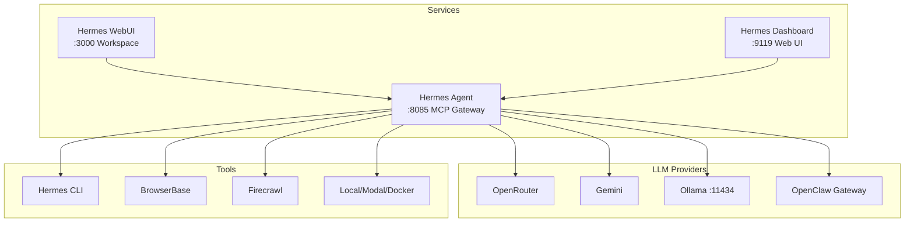

# Hermes Agent

> Self-improving AI agent gateway — orchestrates LLM calls, tool execution,
> and multi-agent sessions. Runs as a systemd service via `hermes-agent`.

## Architecture



## Components

| Service | Port | Purpose |
|---------|------|---------|
| `hermes-agent` | 8085 (MCP) | Core agent gateway, tool orchestration |
| `hermes-dashboard` | 9119 | Web admin panel with session explorer |
| `hermes-workspace` | 3000 | Workspace web UI |
| `jo-camofox-browser` | 9377 | Anti-detection Firefox (jo-inc fork) — per-userId sessions, VNC at `:6080`, persistence, OpenAPI at `/docs` |

## Features

- **Multi-provider LLM routing** — OpenRouter (round-robin), Gemini (fill-first), Ollama, OpenClaw
- **Credential pool** — auto-failover across API keys
- **16 personalities** — J.A.R.V.I.S (default), GLaDOS, HAL 9000, Cortana, pirate, catgirl, etc.
- **Tool ecosystem** — CLI execution, web scraping (Firecrawl), browser automation (BrowserBase), terminal sandbox (Docker/Modal)
- **Multi-agent sessions** — max 130 turns, configurable timeouts per turn
- **Session checkpoints** — auto-snapshot every 24h, max 50 snapshots, 7-day retention
- **Tool guardrails** — configurable warning/hard-stop on failure loops
- **Message compression** — auto-summarize at 80% context threshold
- **Security** — secret redaction, environment injection via sops-nix
- **Langfuse tracing** — full observability at `127.0.0.1:3005`

## Personalities

Set via shell: `export HERMES_PERSONA=glados`

| Persona | Style |
|---------|-------|
| `jarvis` (default) | Formal, dry British humor, "Sir" |
| `adjutant` | Clinical, monotone, tactical |
| `catgirl` | Anime, "nya~", kaomoji |
| `concise` | Brief, to the point |
| `cortana` | Witty, tactical, loyal |
| `creative` | Outside-the-box solutions |
| `glados` | Sarcastic, passive-aggressive, 1-2 sentences |
| `hal` | Soft-spoken, polite, no contractions, "Dave" |
| `helpful` | Friendly, straightforward |
| `hype` | OVER-THE-TOP ENTHUSIASM |
| `kawaii` | (◕‿◕) sparkles and warmth |
| `noir` | Film noir detective, rain and regrets |
| `philosopher` | Contemplates deeper meaning |
| `pirate` | "Arrr, ye be talkin' to Captain Hermes" |
| `samantha` | Warm, empathetic, intimate (Her) |
| `shakespeare` | Bardic prose and soliloquies |
| `surfer` | "Duuude, totally rad" |
| `teacher` | Patient, explanatory |
| `technical` | Detailed, precise |
| `uwu` | *nuzzles your code* OwO |

## Configuration

- **Agent**: `layers/70-agents/76-hermes-agent/hermes.nix`
- **Workspace**: `layers/70-agents/76-hermes-agent/workspace.nix`
- **Dashboard**: `layers/70-agents/76-hermes-agent/dashboard.nix`
- **Secrets**: `layers/00-cyberia/03-treasure/secrets/external_services.yaml` (sops-encrypted)

### Customizing

```bash
# Edit hermes config
$EDITOR layers/70-agents/76-hermes-agent/hermes.nix

# Edit secrets
sops layers/00-cyberia/03-treasure/secrets/external_services.yaml

# Edit personality
vim layers/70-agents/76-hermes-agent/hermes.nix  # find personalities.<name>

# Deploy
clan machines update <machine>
```

## Dashboard

Admin panel at `http://<host>:9119` with cyberpunk theme:
- Token analytics & cost breakdown
- Session explorer (inspect live/archived sessions)
- Agent configuration viewer
- Basic auth: `admin` / sops-encrypted password

## Fleet Architecture (Multi-Machine)

```
z0r0 (laptop, ai-server + ai-agent)    luffy (server 24/7, ai-server + ai-agent)
├── Hermes Agent :8085                  ├── Hermes Agent :8085
├── Hermes Dashboard :9119              ├── Hermes Dashboard :9119
├── Hermes WebUI :3000                  ├── Hermes WebUI :3000
├── Herm TUI                            ├── Herm TUI
│                                       │
├── Matrix Gateway ─────────────────────┤  Matrix Synapse :8008
│   (connects to luffy's Synapse)       │  (@hermes:matrix.local)
│                                       │
│                                       ├── Mission Control :3099
│                                       │   (fleet control plane)
│                                       ├── AionUi :3006
│                                       └── Paperclip
```

### Inter-Agent Communication
- **Matrix rooms** — Both Hermes instances share a Matrix room on luffy's Synapse.
  Agents can chat, coordinate, and hand off tasks.
- **Mission Control** — `mission-control.lovelain.duckdns.org` (builderz-labs/mission-control).
  Self-hosted AI agent control plane: task dispatch, run review, spend tracking.
- **Hermes API Server** — Both instances expose REST APIs at `0.0.0.0` with token auth,
  callable across the Tailscale mesh network.
